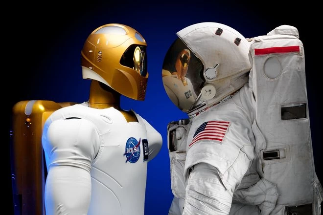
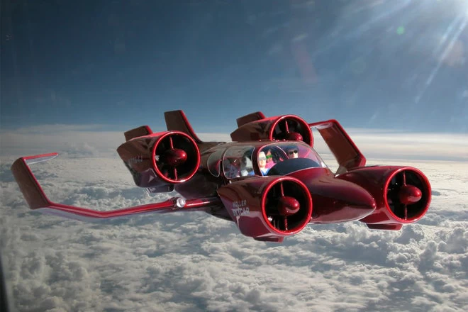

Technology has the power to do many things, and changing the world is one of them.

We're privileged to be living in a time where science and technology can assist us, make our lives easier and rethink the ways we go about our daily lives.The technology we're already exposed and accustomed to has paved the way for us to innovate further, and this list of current and future technologies certainly have the potential to change our lives even more

### Here are some of the Technologies that's going to change

##### Space Tourism 
We can fly to virtually any country in the world without any trouble, but what if we could all one day see the earth from space?
Companies such as Virgin Galactic, SpaceX and even Amazon's Blue Origin, want to make it a reality one day, and give us a (very expensive) seat aboard a spaceship to take us into orbit. Passengers on Amazon's New Shepard space shuttle will be taken 100km above sea level, before parachuting back to earth

[Blue Origin](origin.webp)

###### Colonisation

We've been wreaking havoc on Earth for a long time and the planet can only put up with mankind's destructive nature for so long.

If we don't destroy it, we'll one day outgrow it. Plans are in the works to colonise other planets and Mars will no doubt be the first port of call.

##### Workplace in Space 
Robots can take on the more difficult, dangerous and dull jobs to save mankind the trouble and risk. They can also theoretically operate more quickly, efficiently and with fewer mistakes too

##### Self-driving cars
Car batteries are lasting longer, the charging station infrastructure is growing and self-driving technology is being heavily invested in meaning it's coming sooner than you probably think.

Tesla already has a complex Autopilot mode that can take over some driving controls, but one-day car manufacturers hope to let us go completely hands-free

##### Flying cars
When there's no space left on the roads, it's not unreasonable to think we might take to the skies. There are already plenty of interesting flying car designs that show this future is a realistic possibility

###### For More Content on Future Tech Please visit 
[Tech Innovations](https://www.pocket-lint.com/gadgets/news/142027-tech-innovations-that-will-shortly-change-the-world)